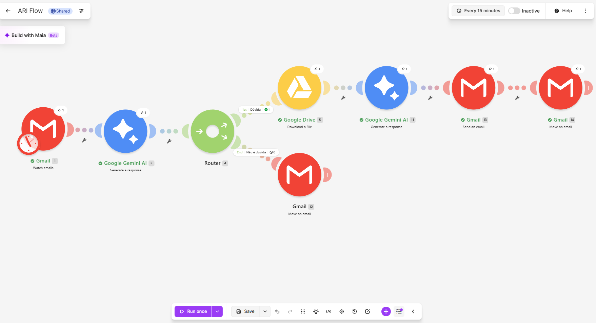
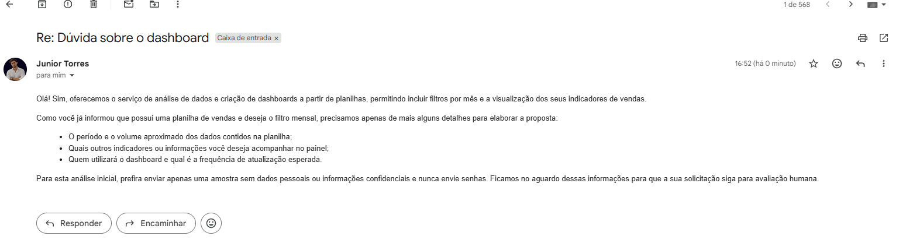
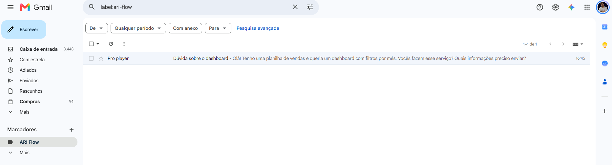

# ARI Flow

Projeto de estudo de automação de atendimento por e-mail no Make, com Gmail, Google Gemini e Google Drive.

## Objetivo

Classificar mensagens, responder dúvidas com apoio de uma base de conhecimento e organizar os e-mails após o atendimento.

A base de demonstração reúne informações sobre criação de sites, automação de processos, análise de dados e relatórios, suporte e manutenção.

## Como funciona

1. O Gmail identifica novos e-mails.
2. O primeiro módulo Gemini classifica a mensagem.
3. O router separa dúvidas das demais mensagens.
4. Para dúvidas, o Google Drive baixa a base de conhecimento e o segundo módulo Gemini prepara a resposta.
5. O Gmail envia automaticamente a resposta ao remetente.
6. Após o envio, o fluxo move automaticamente o e-mail original da caixa de entrada para o marcador **ARI Flow**.
7. As demais mensagens seguem uma rota separada de movimentação.

## Ferramentas

- Make
- Gmail
- Google Gemini
- Google Drive

## Demonstração

Foi realizado um teste manual com uma dúvida sobre a criação de um dashboard de vendas com filtros por mês. A rota de atendimento concluiu a classificação, a consulta à base, a geração e o envio da resposta e a organização do e-mail original.

### Fluxo executado

Os módulos da rota de dúvidas concluíram a execução do teste.

### Resposta automática

A resposta confirmou o serviço de análise de dados e dashboards e solicitou informações sobre o período e o volume dos dados, os indicadores desejados, os usuários do painel e a frequência de atualização.

### E-mail organizado

Após enviar a resposta, o fluxo move automaticamente a mensagem original da caixa de entrada para o marcador **ARI Flow**, organizando os e-mails já atendidos.

## Estado atual

- A rota de dúvidas foi demonstrada em um teste manual completo sobre dashboards.
- O agendamento estava desativado na execução registrada nas imagens.
- A rota de mensagens que não são dúvidas e os demais serviços ainda precisam de testes específicos.
- O funcionamento depende das conexões configuradas e da disponibilidade e dos limites da API do Gemini.

## Visualizar o fluxo

[Acessar o cenário compartilhado no Make](https://us2.make.com/public/shared-scenario/BZJTZdqODGO/ari-flow)

## Blueprint

O arquivo [ari-flow.blueprint.json](ari-flow.blueprint.json) contém a estrutura exportada do cenário no Make. Para reutilizar o fluxo, importe o blueprint e configure suas próprias conexões do Gmail, Google Gemini e Google Drive, o documento da base de conhecimento, os marcadores e um modelo Gemini disponível na sua conta.

As imagens registram o teste realizado no Make. O blueprint atualizado utiliza o modelo `gemini-3.6-flash` nos dois módulos Gemini. Para importar o cenário, selecione um modelo disponível na sua conta.
